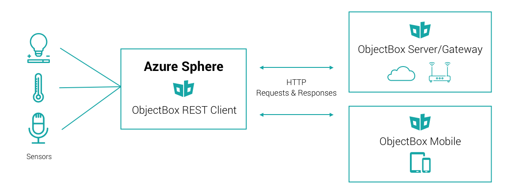

# ObjectBox REST client for Azure Sphere

## Setup

For setting up the basic environment, please check out [the official installation instructions](https://docs.microsoft.com/en-us/azure-sphere/install/overview) for Azure Sphere by Microsoft.

Before running the demo application on the Azure Sphere development board, you need to start the ObjectBox HTTP database server.
After that, identify the server machine's IP address and edit the value of [`Capabilities.AllowedConnections` in `app_manifest.json`](azure-sphere-test/app_manifest.json#L8).
Because of its internal security features, the Azure Sphere device lets the demo application connect only to the IP addresses and hostnames specified here.

Next, assuming you have successfully attached the Azure Sphere development board to your computer, and it's connected to the internet or local network, you can open this project's `objectbox-azure-sphere.sln` solution in Visual Studio.
Finally, open the `azure-sphere-test` project and run it.
On success, it will output some demo information extracted from the database it connected to.

## Architecture

The image above illustrates how the Azure Sphere connects to the server (which also can be a mobile phone) and what kind of data is exchanged.

First, note that the HTTP server needs to run on a separate machine.
This could be a normal PC in the same local network as the Azure Sphere during development, or an actual server with its own IP address or hostname in production.

The library `objectbox-client-azure-sphere` provided in this repository then connects to this server and exchanges data with it via a simple REST protocol.
Specifically, `GET` requests are used to get the number of entries in an entity or get a single or all entries.
`POST` is used for inserting data, updating entries uses `PUT`, and deleting them uses `DELETE`.

All payload of the various requests uses [FlatBuffers](https://google.github.io/flatbuffers/),
specifically [flatcc](https://github.com/dvidelabs/flatcc) for data serialization and deserialization.
The application running on the Azure Sphere device needs to know the data model in advance, e.g. by already being built with the compiled model.

## API

`objectbox-client-azure-sphere` gives developers the option to interact with the HTTP server using the following operations.
All methods, structs and error codes special to this library are prefixed with `obxc_`, `OBXC_` and `OBXC_`, respectively.
Identifiers that are used in other ObjectBox libraries as well, for example [objectbox-c](https://github.com/objectbox/objectbox-c),
use `obx_`, `OBX_` and `OBX_`, respectively.

### Initialization

First, an instance of the `OBXC_store_options` structure must be created. The following attributes must be set for that:

- `base_url`: The HTTP server's API base URL, e.g. `"http://192.168.178.54:8181/api/v2"`.
- `db`: The name of the desired database to connect to.
- `user` and `pass`: Username and password, respectively, needed to access the database.
  May be the empty string if no authentication is needed.
- `model.data` and `model.size`: For now always `NULL` and `0`, respectively.

After that, an instance of `OBXC_store*` can be created from these options using the function `OBXC_store* obxc_store_open(const OBXC_store_options* options)`.
It needs a pointer to a `OBXC_store_options` instance as its first and only parameter.
If the return value is `NULL`, creating the instance failed and further information may be obtained using the error handling methods presented below.

Finally, `obxc_store_close` must be used to correctly close the connection and deallocate all data associated with the store instance.

### General operations

All operations need a valid pointer to a `OBXC_store` instance as their first parameter to unambiguously identify the targeted database.

*`obx_err obxc_data_count(OBXC_store* store, int entityId, uint64_t* count)`*:
Counts the number of entries in the entity with id `entityId` and writes the result to the 64 bit integer value pointed to by `count`.

### Data retrieval

*`obx_err obxc_data_get(OBXC_store* store, int entityId, int id, OBXC_bytes* dest)`*
fetches the serialized FlatBuffers bytes of an entry with id `id` in the entity with id `entityId` into the buffer pointed to by `dest`.
The bytes can then be interpreted by feeding them through flatcc.
The result eventually needs to be deallocated using `obxc_bytes_free`.

*`obx_err obxc_data_get_all(OBXC_store* store, int entityId, OBXC_bytes_array* dest)`*
is similar to the previous function, but gets all entries associated with one entity.
This results also needs to be freed using `obxc_bytes_free`.

## Data modification

*`obx_err obxc_data_insert(OBXC_store* store, int entityId, const OBXC_bytes* src, int* id)`*
inserts a chunk of FlatBuffers-serialized data into the entity with id `entityId`.
The server will automatically assign a new, unique ID to the inserted entry, which will be returned by setting the integer pointed to by the `id` parameter.

*`obx_err obxc_data_update(OBXC_store* store, int entityId, int id, const OBXC_bytes* src)`* updates an entry in an entity with the given data.

*`obx_err obxc_data_delete(OBXC_store* store, int entityId, int id)`* deletes the respective entry from an entity.

### Error handling

All operations return [an error code](objectbox-client-azure-sphere/Inc/Public/objectbox.h#L42), which allows unified error handling.
A return value that is not `OBX_SUCCESS` indicates failure.
Alternatively, the last error code, as well as some more specific information, may be retrieved using the functions `obxc_last_error_code`, `obxc_last_error_message`, `obxc_last_error_secondary`, `obxc_last_error_clear`.
See the [demo application's source](azure-sphere-test/main.c) for a detailed example on how to correctly handle errors.

Note that all operations use the secondary error and the error message to store errors returned by the HTTP server.
This is, a HTTP code and a message explaining why the server rejected your request.

License
-------

    Copyright 2019 ObjectBox Ltd. All rights reserved.
    
    Licensed under the Apache License, Version 2.0 (the "License");
    you may not use this file except in compliance with the License.
    You may obtain a copy of the License at
    
        http://www.apache.org/licenses/LICENSE-2.0
    
    Unless required by applicable law or agreed to in writing, software
    distributed under the License is distributed on an "AS IS" BASIS,
    WITHOUT WARRANTIES OR CONDITIONS OF ANY KIND, either express or implied.
    See the License for the specific language governing permissions and
    limitations under the License.

